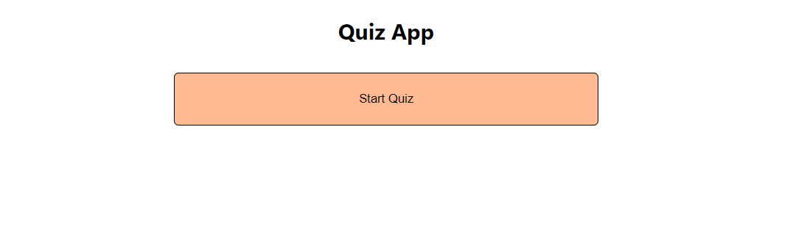
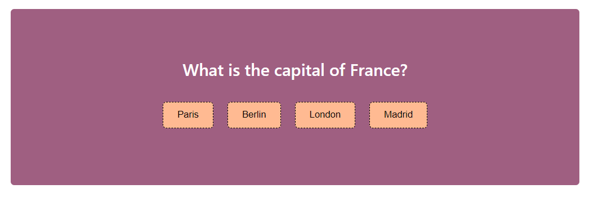
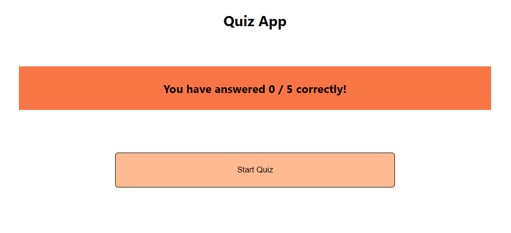

# QuizApp

A dynamic quiz application built using **React**, **JavaScript**, **Enzyme**, and **Jest**. This application allows users to create, manage, and take quizzes with a user-friendly interface and robust state management.

## Features

- **Question Management**: Add, edit, and delete quiz questions seamlessly.
- **Dynamic State Handling**: Efficiently manage application state with React hooks.
- **Conditional Rendering**: Display different components based on user actions and quiz progress.
- **Testing with Enzyme and Jest**: Unit and integration testing for components to ensure reliability.
- **Modular Component Structure**: Clean and maintainable code structure for easy updates and scaling.

## Installation

To get a local copy up and running, follow these steps:

1. **Clone the repository:**
   
   ```bash
   git clone https://github.com/richikraj30/QuizApp.git
2. **Navigate to the project directory:**
    ```bash
   cd QuizApp
3. **Install dependencies:**
    ```bash
   npm install
4. **Start the development server:**
    ```bash
   npm start
Runs the app in the development mode.\
Open [http://localhost:3000](http://localhost:3000) to view it in your browser.

## Testing

1. **To run the tests using Enzyme and Jest:**
   
     ```bash
   npm test

## QuizApp Project Structure
   ```
   QuizApp/
│
├── public/             # Public assets and HTML template
├── src/                # Source code
│   ├── components/     # React components for the quiz app
│   ├── hooks/          # Custom hooks for state management
│   ├── tests/          # Test files for components and features
│   ├── App.js          # Main app component
│   └── index.js        # Entry point of the application
│
├── package.json        # Project metadata and scripts
└── README.md           # Project documentation


   ```

## Technologies Used

- **React**: Frontend library for building user interfaces.
- **Javascript**:Programming language for implementing app logic.
- **Enzyme and Jtest**: Testing libraries for reliable and maintainable code.
- **CSS**: Styling for a clean and responsive user interface.

## Deployment

You can access the live version of the QuizApp here:

[Start Playing](https://richikraj30.github.io/QuizApp/)

## Contributing

Contributions are welcome! If you have suggestions or improvements, feel free to fork the repository and submit a pull request.

1. **Clone the repository:**
2. **Create your feature branch:**

    ```bash
   git checkout -b feature/YourFeature
3. **Commit your changes:**
   ```bash
   git commit -m 'Add some feature'
4.  **Push to the branch:**
    ```bash
    git push origin feature/YourFeature
5. **Open a pull request**

## Screenshots

### Home Page


### Quiz View


### Results Page



## Contact
**Richik Raj**\
**Github**: [richikraj30](http://github.com/richikraj30)
